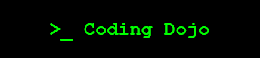

# 

## About

The **Coding Dojo** is a project and monthly [Meetup](https://www.meetup.com/memphis-technology-user-groups) hosted by Code Connector to offer opportunities for learning, mentoring, and practicing coding and problem-solving. Each week, one of our new developers will "drive" a coding challenge with support and guidance from one of our more experienced members.

We are committed to upholding the Code Connector [Code of Conduct](https://codeconnector.io/code-of-conduct), so please review before hopping on. This will be a safe and supportive environment focused on growth and learning, and moderated by active community members.

## Roles

During each meetup, we will have folks fulfilling the following roles:

- Host: An active community member. This is the person who will welcome guests, introduce the challenge, and moderate discussion during the meetup.
- Driver: The primary learner. This is the person who'll be typing code, with input from the Navigator and the Mob.
- Navigator: An experienced developer. This is the person who'll be guiding the Driver towards the solution, offering advice and support.
- Mob: Everyone else. This group is focused on learning from the Navigator and the Driver, while offering suggestions and support of their own.

## Coding Challenges?

Coding challenges are an important part of growth as a developer. We would like to use them as a way to foster growth in both coding ability and software engineering methodologies. Challenges will be added as directories in the root of this project and we will have mobbing sessions as a group for anyone able to join. There will be an effort to work in as many different languages as there is interest in learning. 

Is there already a solution to a puzzle in a language you were hoping to submit? Submit your solution anyway! See our [wiki](https://github.com/codeconnector/CodingDojo/wiki#solutions) for instructions for how to submit a solution. There are often multiple ways to solve a puzzle, even in the same language, and even more ways to extend the existing solutions. For example, you could make the solutions generic, handle additional edge cases, make an animation displaying the steps in the solution, or even turn it into a full-fledged application in some cases. 
